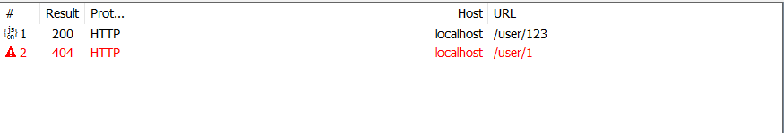

# Spring boot RESTful

## 什么是RESTful风格？

转载自：https://www.cnblogs.com/wmyskxz/p/9104368.html

REST是**REpresentational State Transfer**的缩写（一般中文翻译为表述性状态转移），REST 是一种体系结构，而 HTTP 是一种包含了 REST 架构属性的协议，为了便于理解，我们把它的首字母拆分成不同的几个部分：

- **表述性（REpresentational）：** REST 资源实际上可以用各种形式来进行表述，包括 XML、JSON 甚至 HTML——最适合资源使用者的任意形式；
- **状态（State）：** 当使用 REST 的时候，我们更关注资源的状态而不是对资源采取的行为；
- **转义（Transfer）：** REST 涉及到转移资源数据，它以某种表述性形式从一个应用转移到另一个应用。

**简单地说，REST 就是将资源的状态以适合客户端或服务端的形式从服务端转移到客户端（或者反过来）。**在 REST 中，资源**通过 URL 进行识别和定位**，然后通过**行为(即 HTTP 方法)**来定义 REST 来完成怎样的功能。

#### 实例说明:

在平时的 Web 开发中，method 常用的值是 GET 和 POST，但是实际上，HTTP 方法还有 PATCH、DELETE、PUT 等其他值，这些方法又通常会匹配为如下的 CRUD 动作:

| CRUD 动作 |  HTTP 方法   |
| :-------: | :----------: |
|  Create   |     POST     |
|   Read    |     GET      |
|  Update   | PUT 或 PATCH |
|  Delete   |    DELETE    |

尽管通常来讲，HTTP 方法会映射为 CRUD 动作，但这并不是严格的限制，有时候 PUT 也可以用来创建新的资源，POST 也可以用来更新资源。实际上，POST 请求**非幂等的特性**(即同一个 URL 可以得到不同的结果)使其成一个非常灵活地方法，对于无法适应其他 HTTP 方法语义的操作，它都能够胜任。


在传统的开发过程中，我们的控制Controller层通常需要转向一个JSP视图；但随着WEB2.0相关技术的崛起，我们很多时候只需要返回数据即可，而不是一个JSP页面。

@ResponseBody 提供了一种很有用的方式，能够将控制器返回的 Java 对象转换为发送到客户端的资源表述。

一个好的 REST API 不仅仅能够在客户端和服务器之间传递资源，他还能够给客户端提供额外的数据，帮助客户端理解资源或者在请求中发生了什么情况。

- ResponseEntity：表示整个HTTP响应：状态代码，标题和正文。因此，我们可以使用它来完全配置HTTP响应，它是一个对象。
- @ResponseBody：返回json格式的结果
- @ResponseStatus：返回状态

 

## ResponseEntity

ResponseEntity是一种泛型类型。因此，我们可以使用任何类型作为响应主体：

```java
@Controller
public class XXXController{

 @GetMapping("/hello")
 public ResponseEntity<String> hello() {
   return new ResponseEntity<>("Hello World!", HttpStatus.OK);
}			   
```

这里字符串"Hello World!"作为字符串返回给REST端。

我们可以设置HTTP标头：

```java
@GetMapping("/customHeader")
ResponseEntity<String> customHeader() {
   HttpHeaders headers = new HttpHeaders();
   headers.add("Custom-Header", "foo");

   return new ResponseEntity<>(
         "Custom header set", headers, HttpStatus.OK);
}
```

设置自定义标头：

```java
@GetMapping("/customHeader")
ResponseEntity<String> customHeader() {
   return ResponseEntity.ok()
         .header("Custom-Header", "foo")
         .body("Custom header set")
```

如果将一个对象放入：

```java
@GetMapping("/hello")
 public ResponseEntity<String> hello() {
   return new ResponseEntity<>(new User(‘jdon’), HttpStatus.OK);
 }
```

返回的是JSON字符串：

[ { ‘name’: 'jdon'}]

下面是返回对象的JSON列表：

```java
public ResponseEntity<List<ProcessDef>> repositoryProcessDefinitionsGet() {
   return new ResponseEntity<>(processDefRepo.findAll(), HttpStatus.FOUND);
}
```

以上是通过ResponseEntity这个对象在代码中灵活操控响应，但是在一般情况下我们只是想返回一个带有数据的正常响应，那么只要使用@注解即可


如果，根据给定 id，无法找到某个 User 对象，则 getUserById 返回 null 的同时，HTTP 状态码为 200，所有的过程看起来都很合理。但是，所有的事情都是不对的，客户端要求 User 对象，但是它什么都没有得到。客户端既没有收到 User 对象，也没有收到任何消息表示出现了错误。

Spring提供了以下几种方式来处理这样的场景。 
1. 使用 @ResponseStatus 注解可以指定状态码； 
2. 控制器方法可以返回 ResponseEntity 对象，该对象包含更多相关的元数据； 
3. 异常处理器能够应对错误场景，这样处理器方法就能关注正常状况；

使用 ResponseEntity
ResponseEntity 中包含了响应相关的元数据（头部信息和状态码）以及要转换成资源表述的对象。

添加状态码

所以当无法找到 User 对象的时候，我们可以返回 HTTP 404 错误。

```java
@GetMapping("/{id}")
    public ResponseEntity<User> selectUserById(@PathVariable Long id) {
        User result = userService.selectUserById(id);
        //当无法找到 User 对象的时候，我们可以返回 HTTP 404 错误。
        HttpStatus status = result != null ? HttpStatus.OK : HttpStatus.NOT_FOUND;
        return new ResponseEntity<>(result, status);
    }
```




## @ResponseBody

在类级别使用@Controller标注情况下， @ResponseBody注解告诉返回的对象将自动序列化为JSON，并通过回控制器的HttpResponse对象。

```
@Controller
public class XXXController{

  @ResponseBody
  public User postResponseController(@RequestBody LoginForm loginForm) {
      return new User("Thanks For Posting!!!");
  }
```

将返回客户端JSON字符串：

[ { ‘name’: Thanks For Posting!!!"}]

在@RestController注解了类的情况下，我们就不需要再使用@ResponseBody了。

 

## @ResponseStatus

ResponseStatus虽然只是规定了返回的状态，但是只需要标注在方法上，简单，而且状态码与返回类型分离，比较清晰。我们将上面返回对象列表的代码使用ResponseStatus改写如下，注意类级别@RestController:

```
@RestController
public class XXXController{

 @ResponseStatus(HttpStatus.FOUND)
 public User postResponseController() {
    return new User("Thanks For Posting!!!");
 }
```

这也会返回客户端JSON字符串：

[ { ‘name’: Thanks For Posting!!!"}]

这样的代码更加专注于业务。


## 直接操控响应

Spring还允许我们直接访问javax.servlet.http.HttpServletResponse对象; 我们只需要将它声明为方法参数：

```
@GetMapping("/manual")
public void manual(HttpServletResponse response) throws IOException {
      response.setHeader("Custom-Header", "foo");
      response.setStatus(200);
      response.getWriter().println("Hello World!");
      }
```

由于Spring在底层实现之上提供了抽象和附加功能，因此如果以这种方式直接操纵响应，会失去很多Spring提供方便功能。

 

### 常用HttpStatus状态：

- HttpStatus.OK = 200;
- HttpStatus.BAD_REQUEST = 400;
- HttpStatus.FORBIDDEN = 403;
- HttpStatus.NOT_FOUND = 404;
- HttpStatus.REQUEST_TIMEOUT = 408;
- HttpStatus.SERVICE_UNAVAILABLE =500;


### HttpStatus状态码详解

```java
HttpStatus = {  
        //Informational 1xx  信息
        '100' : 'Continue',  //继续
        '101' : 'Switching Protocols',  //交换协议
 
        //Successful 2xx  成功
        '200' : 'OK',  //OK
        '201' : 'Created',  //创建
        '202' : 'Accepted',  //已接受
        '203' : 'Non-Authoritative Information',  //非权威信息
        '204' : 'No Content',  //没有内容
        '205' : 'Reset Content',  //重置内容
        '206' : 'Partial Content',  //部分内容
 
        //Redirection 3xx  重定向
        '300' : 'Multiple Choices',  //多种选择
        '301' : 'Moved Permanently',  //永久移动
        '302' : 'Found',  //找到
        '303' : 'See Other',  //参见其他
        '304' : 'Not Modified',  //未修改
        '305' : 'Use Proxy',  //使用代理
        '306' : 'Unused',  //未使用
        '307' : 'Temporary Redirect',  //暂时重定向
 
        //Client Error 4xx  客户端错误
        '400' : 'Bad Request',  //错误的请求
        '401' : 'Unauthorized',  //未经授权
        '402' : 'Payment Required',  //付费请求
        '403' : 'Forbidden',  //禁止
        '404' : 'Not Found',  //没有找到
        '405' : 'Method Not Allowed',  //方法不允许
        '406' : 'Not Acceptable',  //不可接受
        '407' : 'Proxy Authentication Required',  //需要代理身份验证
        '408' : 'Request Timeout',  //请求超时
        '409' : 'Conflict',  //指令冲突
        '410' : 'Gone',  //文档永久地离开了指定的位置
        '411' : 'Length Required',  //需要Content-Length头请求
        '412' : 'Precondition Failed',  //前提条件失败
        '413' : 'Request Entity Too Large',  //请求实体太大
        '414' : 'Request-URI Too Long',  //请求URI太长
        '415' : 'Unsupported Media Type',  //不支持的媒体类型
        '416' : 'Requested Range Not Satisfiable',  //请求的范围不可满足
        '417' : 'Expectation Failed',  //期望失败
 
        //Server Error 5xx  服务器错误
        '500' : 'Internal Server Error',  //内部服务器错误
        '501' : 'Not Implemented',  //未实现
        '502' : 'Bad Gateway',  //错误的网关
        '503' : 'Service Unavailable',  //服务不可用
        '504' : 'Gateway Timeout',  //网关超时
        '505' : 'HTTP Version Not Supported'  //HTTP版本不支持
};  
```


## trim标签四个属性

prefix，prefixOverrides，suffix，suffixOverrides
本人一直对这四个标签的名字无法理解，并对其功能感到混乱。下面是自己思考后的一些总结：

trim标签使用
1、trim 有四个属性 
2、prefix，suffix 表示在trim标签包裹的部分的前面或者后面添加内容（注意：是没有prefixOverrides，suffixOverrides的情况下） 
3、如果有prefixOverrides，suffixOverrides 表示**覆盖**Overrides中的内容。 
4、如果只有prefixOverrides，suffixOverrides 表示删除。
例如：

```xml
<update id="testTrim" parameterType="com.mybatis.pojo.User">
    update user
    <trim prefix="set" suffixOverrides=",">
        <if test="cash!=null and cash!=''">cash= #{cash},</if>
        <if test="address!=null and address!=''">address= #{address},</if>
    </trim>
    <where>id = #{id}</where>
</update>
只有prefix=“set”，表示在trim包裹的部分的前面添加 set。 
只有suffixOverrides=“,”，表示删除最后一个逗号。
```
上例也可以写成

```xml
<update id="testTrim" parameterType="com.mybatis.pojo.User">
    update user
    set
    <trim suffixOverrides="," suffix="where id = #{id}">
        <if test="cash!=null and cash!=''">cash= #{cash},</if>
        <if test="address!=null and address!=''">address= #{address},</if>
    </trim>
</update>
由于set写在了外面，trim中就不再需要prefix属性了，所以删除。 
```
where标签从外面拿进trim里面，这样其实可以认为是将最后一个逗号”,”替换成了where id = #{id}。所以suffix和suffixOverrides一起使用。


## Mybatis懒加载

转载自：https://www.liangzl.com/get-article-detail-3670.html