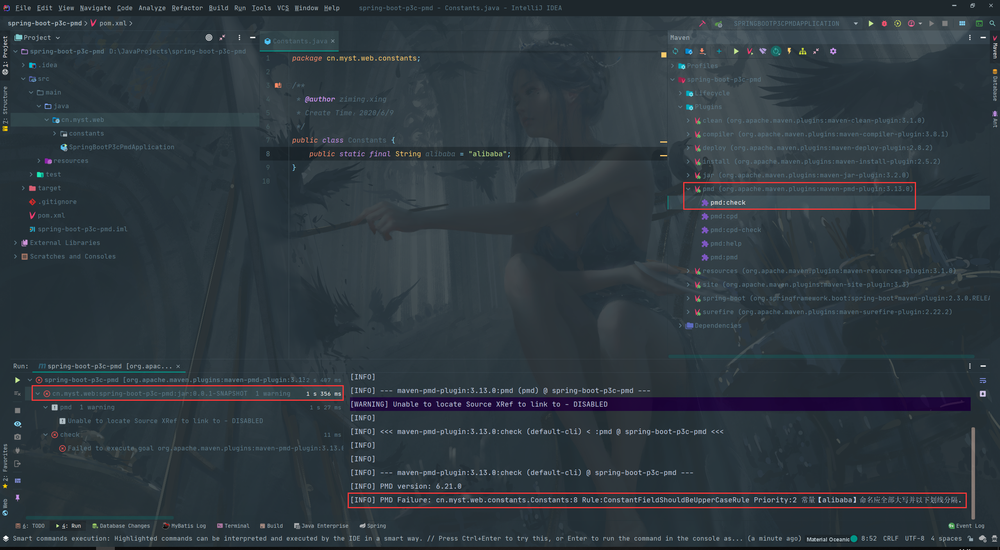

# 阿里巴巴Java代码扫描插件P3C（PMD）

**今天开发的时候发现了一个好用的plugin：maven-checkstyle-plugin，可以帮助程序员检测代码中不符合规范的地方，大大方便程序开发。**

## maven使用阿里的p3c-pmd的规范

只需要配置pom.xml就可以。

### pom.xml文件配置

```xml
    <!-- 阿里云Maven仓库 -->
    <pluginRepositories>
        <pluginRepository>
            <id>aliYun</id>
            <name>aliYun maven</name>
            <url>http://maven.aliyun.com/nexus/content/groups/public/</url>
            <releases>
                <enabled>true</enabled>
            </releases>
            <snapshots>
                <enabled>false</enabled>
            </snapshots>
        </pluginRepository>
    </pluginRepositories>

    <build>
        <plugins>
            <!-- 阿里巴巴Java代码编程规范扫描插件P3C（PMD） Start -->
            <plugin>
                <groupId>org.apache.maven.plugins</groupId>
                <artifactId>maven-pmd-plugin</artifactId>
                <version>3.13.0</version>
                <configuration>
                    <excludes>
                        <exclude>**/*Test.java</exclude>
                        <exclude>**/*Tests.java</exclude>
                    </excludes>
                    <rulesets>
                        <ruleset>rulesets/java/ali-comment.xml</ruleset>
                        <ruleset>rulesets/java/ali-concurrent.xml</ruleset>
                        <ruleset>rulesets/java/ali-constant.xml</ruleset>
                        <ruleset>rulesets/java/ali-exception.xml</ruleset>
                        <ruleset>rulesets/java/ali-flowcontrol.xml</ruleset>
                        <ruleset>rulesets/java/ali-naming.xml</ruleset>
                        <ruleset>rulesets/java/ali-oop.xml</ruleset>
                        <ruleset>rulesets/java/ali-orm.xml</ruleset>
                        <ruleset>rulesets/java/ali-other.xml</ruleset>
                        <ruleset>rulesets/java/ali-set.xml</ruleset>
                    </rulesets>
                    <failurePriority>2</failurePriority>
                    <printFailingErrors>true</printFailingErrors>
                </configuration>
                <executions>
                    <!-- 绑定pmd:pmd到validate生命周期，在validate时会自动进行代码规范检查 -->
                    <execution>
                        <id>validate</id>
                        <phase>validate</phase>
                        <goals>
                            <goal>check</goal>
                        </goals>
                    </execution>
                    <!-- 绑定pmd:check到verify生命周期 -->
                    <execution>
                        <id>pmd-check-verify</id>
                        <phase>verify</phase>
                        <goals>
                            <goal>check</goal>
                        </goals>
                    </execution>
                    <!-- 绑定pmd:pmd到site生命周期 -->
                    <execution>
                        <id>pmd-pmd-site</id>
                        <phase>site</phase>
                        <goals>
                            <goal>pmd</goal>
                        </goals>
                    </execution>
                </executions>
                <dependencies>
                    <!-- 需要使用阿里的一些xml文件，因此需要这里增加p3c的依赖 -->
                    <dependency>
                        <groupId>com.alibaba.p3c</groupId>
                        <artifactId>p3c-pmd</artifactId>
                        <version>2.0.1</version>
                    </dependency>
                </dependencies>
            </plugin>
            <!-- 阿里巴巴Java代码编程规范扫描插件P3C（PMD） End -->
        </plugins>
    </build>
```

### 运行命令：mvn pmd:check

